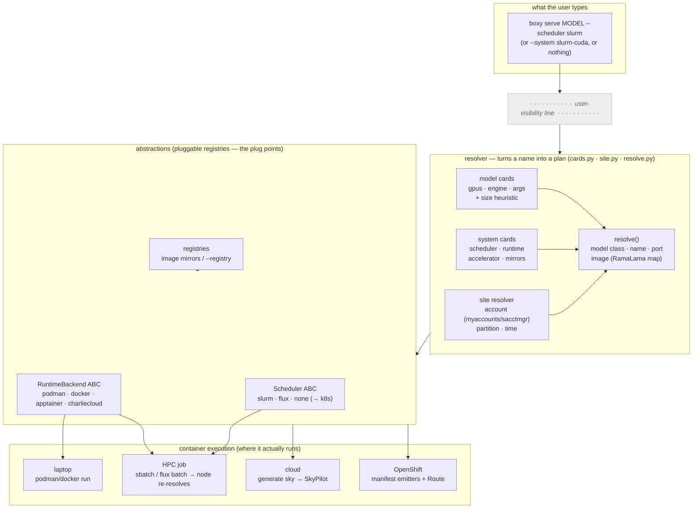

# boxy architecture — where the machinery is hidden

boxy is **container-first**: one command deploys a model anywhere, and the
scheduler and container runtime are implementation details the abstraction
hides. This document shows *where* that hiding happens — the layer boundaries a
user never has to cross.

The turnkey promise:

```bash
boxy serve meta-llama/Llama-3.3-70B-Instruct --scheduler slurm
```

No `--gpus`, `--account`, `--partition`, `--time`, `--accelerator`, `--image`,
`--runtime`. A user with zero SLURM/container knowledge gets a served model, from
laptop to cluster. Power users still pass any of those flags — **explicit always
wins**.

---

## 1. Layered architecture

Everything **below the dashed line is hidden machinery** — the user names a model
(and at most a target class). The resolver turns that into a concrete plan; the
driver layers turn the plan into a running container, wherever it runs.



**Reading it:** the user touches only the top box. The **resolver** consults
declarative *cards* (per-model geometry, per-system-type profile) and *site*
probes (account) to produce a full plan, printing every decision as an `auto:`
line. The plan flows through two ABCs — one hides the scheduler, one hides the
container runtime — so swapping Podman for Apptainer for CharlieCloud, or Slurm
for Flux for Kubernetes, changes nothing the user sees.

---

## 2. Turnkey sequence — `boxy serve llama-3.3-70b --scheduler slurm`

How one flagless command becomes a running 70B server, with the machinery
labeled at each step.

```mermaid
sequenceDiagram
    autonumber
    actor User
    participant CLI as boxy (login node)
    participant Cards as model+system cards
    participant Site as site.py (account)
    participant Sched as Scheduler ABC (slurm)
    participant Node as compute node (boxy --here)
    participant RT as RuntimeBackend

    User->>CLI: serve Llama-3.3-70B --scheduler slurm
    CLI->>Cards: card for this model?
    Cards-->>CLI: gpus=4, engine=vllm, max_model_len=8192
    CLI->>Site: account? (myaccounts → env → sacctmgr)
    Site-->>CLI: ab110003  (auto: account …)
    CLI->>Sched: batch_script(directives, inner serve)
    Sched-->>CLI: #SBATCH --gpus-per-node=4 --account=ab110003 …
    CLI->>Sched: sbatch  (or emit only, on --dryrun)
    Note over CLI,Node: job detaches; login node polls for READY
    Node->>Node: boxy serve --foreground --here (re-resolves HW here)
    Node->>RT: podman run vLLM image (accelerator detected ON the node)
    RT-->>Node: /v1 up → writes endpoint over shared FS
    Node-->>User: ### READY http://node:8000/v1
```

**The load-bearing trick (step 9):** the login node only *classifies + sizes +
names + accounts*. The real hardware truths (accelerator, exact image, port) are
re-resolved **on the compute node**, where they are actually true — so a GPU-less
login node never has to guess. The same wheel resolves the same cards on both
sides, so no per-flag plumbing crosses the boundary.

---

## 3. Plug-point matrix — which interface hides what

Each abstraction is a small pluggable registry (a name→class dict + a factory).
Adding a member is one class + one registration; nothing above the line changes.

```mermaid
flowchart LR
    subgraph Cards["cards (data)"]
        direction TB
        c1["hides: model sizing<br/>(GPUs/TP/engine/args)"]
        c2["hides: site profile<br/>(scheduler/runtime/accel/mirrors)"]
    end
    subgraph Sched["Scheduler ABC"]
        direction TB
        s1["hides: #SBATCH vs # flux:<br/>directives, slots"]
        s2["hides: submit / state / cancel<br/>partition→queue, account→bank, time→FSD"]
    end
    subgraph Back["RuntimeBackend ABC"]
        direction TB
        b1["hides: run argv<br/>--network=host vs -p"]
        b2["hides: GPU flags<br/>--device vs --nv vs --nvidia"]
        b3["hides: OCI→SIF build"]
    end
    subgraph Reg["registries + site"]
        direction TB
        r1["hides: image mirror<br/>(air-gap / Zscaler)"]
        r2["hides: account discovery<br/>(myaccounts/sacctmgr)"]
    end

    Cards --> Sched --> Back --> Reg
```



| Interface | File | Hides | Members today | Add a member |
|---|---|---|---|---|
| Model card | `data/cards/models/*.toml` | GPUs, TP, engine, engine args | 9 + size heuristic | drop a TOML |
| System card | `data/cards/systems/*.toml` | scheduler, runtime, accelerator, mirrors | 15 (3×5 types) | drop a TOML |
| `Scheduler` | `schedulers/base.py` | directives, submit/state, site-flag spelling | slurm, flux, none | 1 class + registry |
| `RuntimeBackend` | `backends/base.py` | run argv, GPU flags, SIF build | podman, docker, apptainer, charliecloud | 1 class + registry |
| registries | `registries.py` | image mirror rewrite | mirror map, `--registry` | data |
| site | `site.py` | account/partition/time discovery | myaccounts, env, sacctmgr | 1 probe fn |

---

## Why this shape

- **Cards are data, not code.** A site admin makes a whole cluster turnkey by
  dropping one system-card TOML in `~/.config/boxy/cards/systems/`; a user pins a
  model's geometry with one file in `~/.config/boxy/cards/models/`. User cards
  win over the packaged catalog.
- **Every hidden decision is still printed** as an `auto:` line — hiding the
  machinery, not the choices. `boxy cards` lists the catalog; `--dryrun` prints
  the full plan with zero network.
- **RamaLama** supplies the engine→image map; **SkyPilot** is the cloud backend
  (`boxy generate sky`); boxy owns the abstraction that makes one command reach
  all of laptop, HPC, cloud, and OpenShift.
</content>
